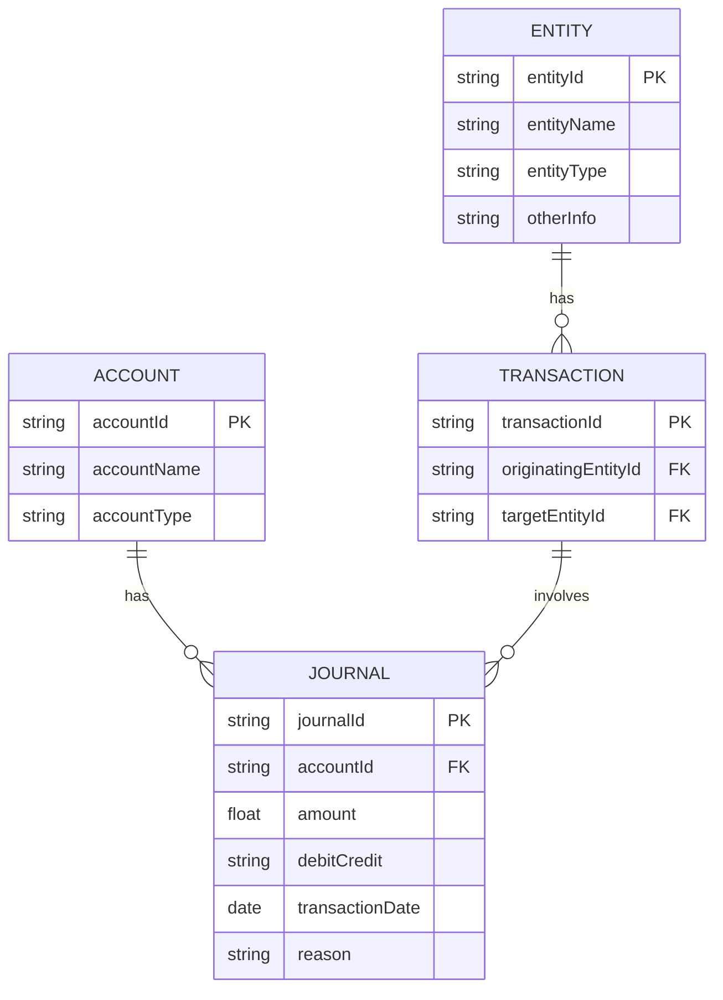

### 勘定科目テーブル:
科目ID
科目名
科目タイプ（資産、負債、収益、費用など）

### 仕訳テーブル:

仕訳ID
勘定科目ID（勘定科目テーブルとの関連）
金額
借方/貸方
取引日
仕分け理由（期末調整など）

### 主体テーブル:

主体ID
主体名
主体タイプ
その他情報

### 取引主体関連テーブル:

取引ID
発生主体ID
対象主体ID




### ポイントを送る
```sql
INSERT INTO 仕訳テーブル (勘定科目ID, 金額, 借方/貸方, 取引日, 仕分け理由)
VALUES
(/* 主体Aのポイント勘定科目ID */, /* 送るポイント量 */, '貸方', CURRENT_DATE, 'ポイント送付'),
(/* 主体Bのポイント勘定科目ID */, /* 受けるポイント量 */, '借方', CURRENT_DATE, 'ポイント受領');

INSERT INTO 取引主体関連テーブル (取引ID, 発生主体ID, 対象主体ID)
VALUES
(/* 新しい取引ID */, /* 主体AのID */, /* 主体BのID */);

```
#### トリガーを使用し、主体間取引が自動的に各主体仕訳を更新する
```sql
CREATE TRIGGER TransferPointsTrigger
AFTER INSERT ON 取引主体関連テーブル
FOR EACH ROW
BEGIN
   -- 主体Aのポイント減少を記録
   INSERT INTO 仕訳テーブル (勘定科目ID, 金額, 借方/貸方, 取引日, 仕分け理由)
   VALUES ((SELECT 科目ID FROM 勘定科目テーブル WHERE 科目名 = 'ポイント' AND 主体ID = NEW.発生主体ID),
           NEW.金額, '貸方', NEW.取引日, 'ポイント送付');

   -- 主体Bのポイント増加を記録
   INSERT INTO 仕訳テーブル (勘定科目ID, 金額, 借方/貸方, 取引日, 仕分け理由)
   VALUES ((SELECT 科目ID FROM 勘定科目テーブル WHERE 科目名 = 'ポイント' AND 主体ID = NEW.対象主体ID),
           NEW.金額, '借方', NEW.取引日, 'ポイント受領');
END;

```

```typescript

const T = {
const ACCOUNT = Type.Object({
    accountId: Type.String({ minLength: 1, maxLength: 50 }),
    accountName: Type.String({ minLength: 1, maxLength: 100 }),
    accountType: Type.String({ minLength: 1, maxLength: 50 }),
})

const JOURNAL = Type.Object({
    journalId: Type.String({ minLength: 1, maxLength: 50 }),
    accountId: Type.String({ minLength: 1, maxLength: 50 }),
    amount: Type.Number(),
    debitCredit: Type.String({ minLength: 1, maxLength: 10 }),
    transactionDate: Type.String({ format: 'date-time' }),
    reason: Type.String({ minLength: 1, maxLength: 200 }),
})

const ENTITY = Type.Object({
    entityId: Type.String({ minLength: 1, maxLength: 50 }),
    entityName: Type.String({ minLength: 1, maxLength: 100 }),
    entityType: Type.String({ minLength: 1, maxLength: 50 }),
    otherInfo: Type.Optional(Type.String({ minLength: 1, maxLength: 200 })),
})

const TRANSACTION = Type.Object({
    transactionId: Type.String({ minLength: 1, maxLength: 50 }),
    originatingEntityId: Type.String({ minLength: 1, maxLength: 50 }),
    targetEntityId: Type.String({ minLength: 1, maxLength: 50 }),
})
}

```

### エンドポイント設計
1. ユーザー登録・更新・削除
1. 取引、利用
    1.  圏外資産＞圏内資産
    1.  圏内資産＞圏外資産
1.  表示
    1. 残高
    1. 履歴
1. 自動設定
    1. 分配率、配当率
    1. 
1. 通知
1. 外部サービス連携
1. ポイント
    1. 有効期限
    1. ランク
1. サポート

#### エンドポイント一覧
```typescript
const endpoints = {
    root: '/economy', // 初期ページ表示
    user: {
        root: '/economy/user',
        register: '/economy/user/register', // ユーザー登録
        update: '/economy/user/update', // ユーザー更新
        delete: '/economy/user/delete', // ユーザー削除
    },
    transaction: {
        root: '/economy/transaction',
        in: '/economy/transaction/in', // 圏外資産＞圏内資産
        out: '/economy/transaction/out', // 圏内資産＞圏外資産
    },
    balance: '/economy/balance', // 残高表示
    history: '/economy/history', // 履歴表示
    setting: {
        root: '/economy/setting',
        auto: '/economy/setting/auto', // 自動設定（分配率、配当率）
    },
    notification: '/economy/notification', // 通知
    external: '/economy/external', // 外部サービス連携
    point: {
        root: '/economy/point',
        expiry: '/economy/point/expiry', // ポイント有効期限
        rank: '/economy/point/rank', // ポイントランク
    },
    support: '/economy/support' // サポート
}
```

### 各エンドポイント
#### 前提
1. Cloudflare Workers, DO and KV, D1, R2を使用します。
1. Honoとそのミドルウェアを使用します。
1. これらのエンドポイントはすでに認証済みのメールとJWTトークンを使用します。

#### 詳細
1. root
    - ポイントエコノミーシステムの初期ページを表示するためのHTMLとTailwindCSS, ハイドレーションするJavascriptを作成します。
    1. get
    1. 要素一覧
        - ボタン
            - ユーザー
            - 各エンドポイントボタン
        - hx-targetとなるターゲット要素
    1. スクリプト機能一覧
        - HTMXヘッダリスナー
        - Service Worker
2. user/register
    - メソッド: POST
    - 実装の流れ: 
        1. ユーザー情報を受け取るフォームを作成します。
        2. フォームの送信ボタンをクリックすると、入力されたユーザー情報をデータベースに保存するスクリプトを実行します。
    - 要素一覧
        - ユーザー情報入力フォーム
        - 送信ボタン
    - スクリプト機能一覧
        - フォーム送信イベントリスナー

3. user/update
    - メソッド: PUT
    - 実装の流れ: 
        1. 更新されたユーザー情報を受け取るフォームを作成します。
        2. フォームの送信ボタンをクリックすると、入力されたユーザー情報をデータベースに保存するスクリプトを実行します。
    - 要素一覧
        - ユーザー情報更新フォーム
        - 送信ボタン
    - スクリプト機能一覧
        - フォーム送信イベントリスナー
4. user/delete
    - メソッド: DELETE
    - 実装の流れ: 
        1. ユーザー削除の確認メッセージを表示します。
        2. 確認後、ユーザー情報をデータベースから削除するスクリプトを実行します。
    - 要素一覧
        - 削除確認メッセージ
        - 確認ボタン
    - スクリプト機能一覧
        - 確認ボタンクリックイベントリスナー

5. user/login
    - メソッド: POST
    - 実装の流れ: 
        1. ユーザーのログイン情報を受け取るフォームを作成します。
        2. フォームの送信ボタンをクリックすると、入力されたログイン情報を使用してユーザーを認証するスクリプトを実行します。
    - 要素一覧
        - ログイン情報入力フォーム
        - 送信ボタン
    - スクリプト機能一覧
        - フォーム送信イベントリスナー

6. user/logout
    - メソッド: POST
    - 実装の流れ: 
        1. ログアウトボタンを作成します。
        2. ログアウトボタンをクリックすると、ユーザーをログアウトするスクリプトを実行します。
    - 要素一覧
        - ログアウトボタン
    - スクリプト機能一覧
        - ボタンクリックイベントリスナー

7. user/points
    - メソッド: GET
    - 実装の流れ: 
        1. ユーザーのポイント情報を表示するエレメントを作成します。
        2. ページロード時、ユーザーのポイント情報をデータベースから取得して表示するスクリプトを実行します。
    - 要素一覧
        - ポイント情報表示エレメント
    - スクリプト機能一覧
        - ページロードイベントリスナー

8. user/transactions
    - メソッド: GET
    - 実装の流れ: 
        1. ユーザーのトランザクション履歴を表示するエレメントを作成します。
        2. ページロード時、ユーザーのトランザクション履歴をデータベースから取得して表示するスクリプトを実行します。
    - 要素一覧
        - トランザクション履歴表示エレメント
    - スクリプト機能一覧
        - ページロードイベントリスナー 
9. setting/auto
    - メソッド: PUT
    - 実装の流れ: 
        1. 自動設定情報（分配率、配当率）を受け取るフォームを作成します。
        2. フォームの送信ボタンをクリックすると、入力された設定情報をデータベースに保存するスクリプトを実行します。
    - 要素一覧
        - 自動設定情報入力フォーム
        - 送信ボタン
    - スクリプト機能一覧
        - フォーム送信イベントリスナー

10. setting/manual
    - メソッド: PUT
    - 実装の流れ: 
        1. 手動設定情報（分配率、配当率）を受け取るフォームを作成します。
        2. フォームの送信ボタンをクリックすると、入力された設定情報をデータベースに保存するスクリプトを実行します。
    - 要素一覧
        - 手動設定情報入力フォーム
        - 送信ボタン
    - スクリプト機能一覧
        - フォーム送信イベントリスナー